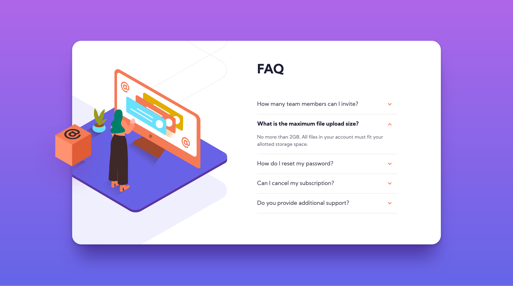

# Frontend Mentor - FAQ accordion card solution

This is a solution to the [FAQ accordion card challenge on Frontend Mentor](https://www.frontendmentor.io/challenges/faq-accordion-card-XlyjD0Oam). Frontend Mentor challenges help you improve your coding skills by building realistic projects. 

## Table of contents

- [Overview](#overview)
  - [The challenge](#the-challenge)
  - [Screenshot](#screenshot)
  - [Links](#links)
- [My process](#my-process)
  - [Built with](#built-with)
  - [What I learned](#what-i-learned)
  - [Useful resources](#useful-resources)
- [Author](#author)

## Overview

### The challenge

Users should be able to:

- View the optimal layout depending on their device's screen size

### Screenshot

### Links

- Solution URL: [Frontend Mentor Solution](https://www.frontendmentor.io/solutions/html-sass-flexbox-css-variables-0mE6-VBEB)
- Live Site URL: [Github Pages](https://rzvr.github.io/faq-accordion-card/)

## My process

### Built with

- Semantic HTML5 markup
- CSS variable
- SASS
- BEM
- Flexbox

### What I learned

In this challenge, I learned how to create a click accordion effect with animation without js.

### Useful resources

- [Youtube](https://www.youtube.com/user/KepowOb) - Great channel about HTML and CSS.
- [Ninja Units](https://www.ninjaunits.com/) - A site where you can convert all possible and necessary in the creation of sites units.
- [Free Frontend](https://freefrontend.com/css-accordions/) - interesting article about creating accordions with and without js.

## Author

- Github - [rzvr](https://github.com/rzvr)
- Frontend Mentor - [@rzvr](https://www.frontendmentor.io/profile/rzvr)

# Frontend Mentor - Stats preview card component solution

This is a solution to the [Stats preview card component challenge on Frontend Mentor](https://www.frontendmentor.io/challenges/stats-preview-card-component-8JqbgoU62). Frontend Mentor challenges help you improve your coding skills by building realistic projects. 

## Table of contents

- [Overview](#overview)
  - [The challenge](#the-challenge)
  - [Screenshot](#screenshot)
  - [Links](#links)
- [My process](#my-process)
  - [Built with](#built-with)
  - [What I learned](#what-i-learned)
  - [Useful resources](#useful-resources)
- [Author](#author)

## Overview

### The challenge

Users should be able to:

- View the optimal layout depending on their device's screen size

### Screenshot

  
Desktop version

  

  
Mobile version

  

### Links

- Solution URL: [Frontend Mentor Solution](https://www.frontendmentor.io/solutions/html-sass-flexbox-css-variables--P-39tNmT)
- Live Site URL: [Github Pages](https://rzvr.github.io/stats-preview-card/)

## My process

### Built with

- Semantic HTML5 markup
- CSS variable
- SASS
- Flexbox
- BEM

### What I learned

In this challenge, after a long pause, I practice creating sites, remembering the main points of HTML, SASS, BEM.

### Useful resources

- [Youtube](https://www.youtube.com/user/KepowOb) - Great channel about HTML and CSS.
- [Ninja Units](https://www.ninjaunits.com/) - A site where you can convert all possible and necessary in the creation of sites units.
- [Free Frontend](https://freefrontend.com/css-accordions/) - interesting article about creating accordions with and without js.

## Author

- Github - [rzvr](https://github.com/rzvr)
- Frontend Mentor - [@rzvr](https://www.frontendmentor.io/profile/rzvr)